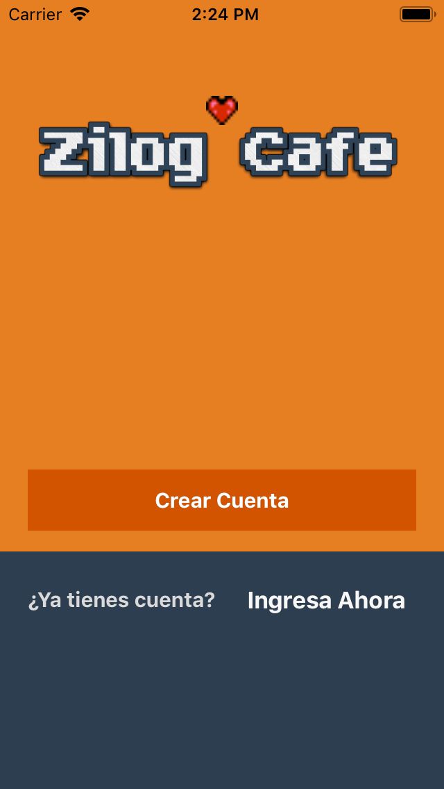

# Zilog Cafe

Made in Late 2013 - Early 2014. This is a prototype of an app for purchasing food using the iPhone. This was way before Uber Eats or Cornershop existed.

Sadly due to lack of funding this never really took off.

image:process.png[]

## Technology

- Parse Framework
- Objective-C

## Video

Because Parse.com is no longer active and the old nature of this code this app cannot be run,

But at least it has a video recorded for posterity.

The "Cafeta" was a rebranding made for a specific presentation.

++++
<video src="zilogcafe.mp4"></video>
++++

## License

MIT
